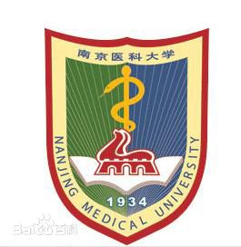
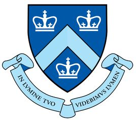

###  NANJING MEDICAL UNIVERSITY   

***

Nanjing, China  
09/2015 ~ 06/2019

  - __Degree:__   Bachelor of Science
  - __Major:__   Public Affairs Management (Health Service Administration)

You can learn something about the university through [the website](http://english.njmu.edu.cn)

let me show you some pictures about my university
This is the school badge of NANJING MEDICAL UNIVERSITY

***

###  Columbia University(Mailman School of Public Health)

***
You can learn something about Columbia University through this [link](https://www.columbia.edu/)

You can learn something about Mailman through this [link](https://www.mailman.columbia.edu)

***

Let me also show you the school badge of Columbia University

 - __Degree:__    Master of Science in Biostatistics(studying)